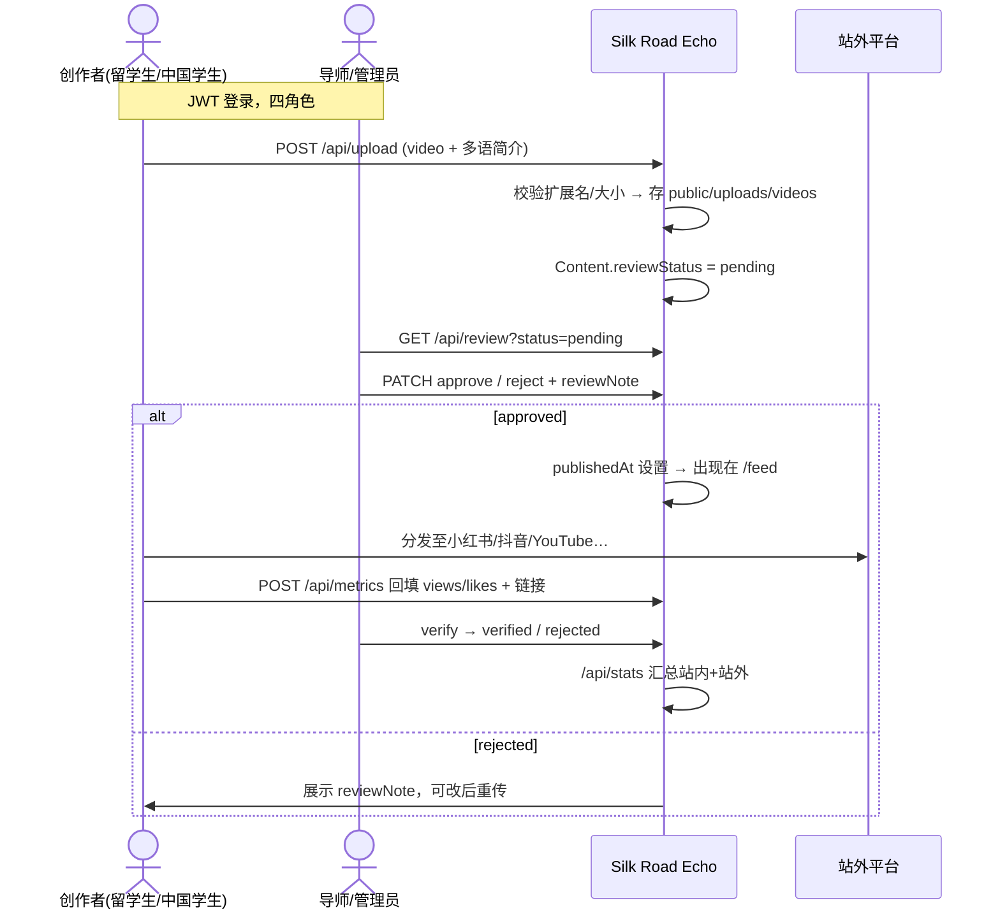
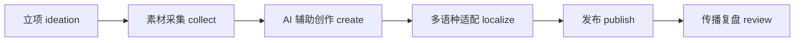
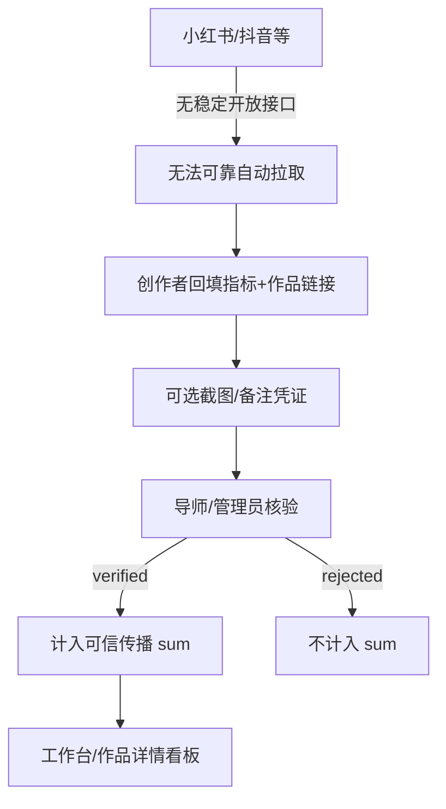
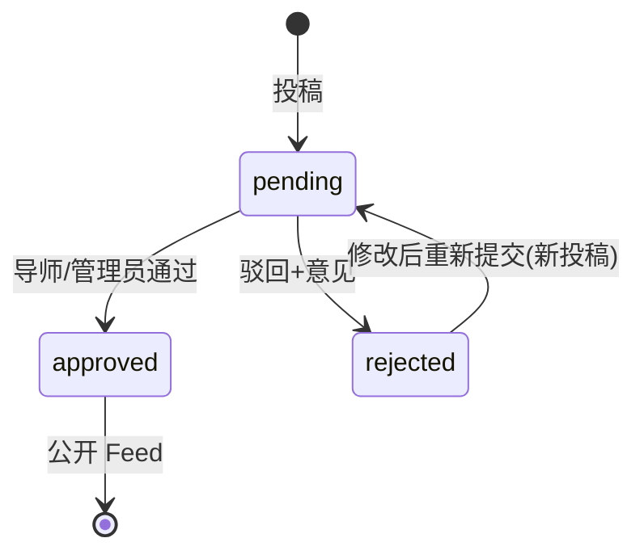

# 业务流程 Business Flow

## 主链路：UGC 投稿 → 审核 → 发布 → 出海 → 回流

```mermaid
sequenceDiagram
  actor U as 创作者(留学生/中国学生)
  actor M as 导师/管理员
  participant S as Silk Road Echo
  participant P as 站外平台
  Note over U,M: JWT 登录，四角色

  U->>S: POST /api/upload (video + 多语简介)
  S->>S: 校验扩展名/大小 → 存 public/uploads/videos
  S->>S: Content.reviewStatus = pending
  M->>S: GET /api/review?status=pending
  M->>S: PATCH approve / reject + reviewNote
  alt approved
    S->>S: publishedAt 设置 → 出现在 /feed
    U->>P: 分发至小红书/抖音/YouTube…
    U->>S: POST /api/metrics 回填 views/likes + 链接
    M->>S: verify → verified / rejected
    S->>S: /api/stats 汇总站内+站外
  else rejected
    S->>U: 展示 reviewNote，可改后重传
  end
```

## OPC 创作路径（项目）

```mermaid
flowchart LR
  A[立项 ideation] --> B[素材采集 collect]
  B --> C[AI 辅助创作 create]
  C --> D[多语种适配 localize]
  D --> E[发布 publish]
  E --> F[传播复盘 review]
```

`Project.opcStage` 字段落库，UI 进度条一致。

## 站外播放统计口径（为何不是「自动抓取」）

```mermaid
flowchart TB
  X[小红书/抖音等] -->|无稳定开放接口| NO[无法可靠自动拉取]
  NO --> R1[创作者回填指标+作品链接]
  R1 --> R2[可选截图/备注凭证]
  R2 --> R3[导师/管理员核验]
  R3 -->|verified| SUM[计入可信传播 sum]
  R3 -->|rejected| OUT[不计入 sum]
  SUM --> DASH[工作台/作品详情看板]
```

示例：作品《喀什的正午，撒马尔罕的黄昏》seed 中含小红书 12800（已核验）等演示数据。

## 审核状态机

```mermaid
stateDiagram-v2
  [*] --> pending: 投稿
  pending --> approved: 导师/管理员通过
  pending --> rejected: 驳回+意见
  rejected --> pending: 修改后重新提交(新投稿)
  approved --> [*]: 公开 Feed
```
